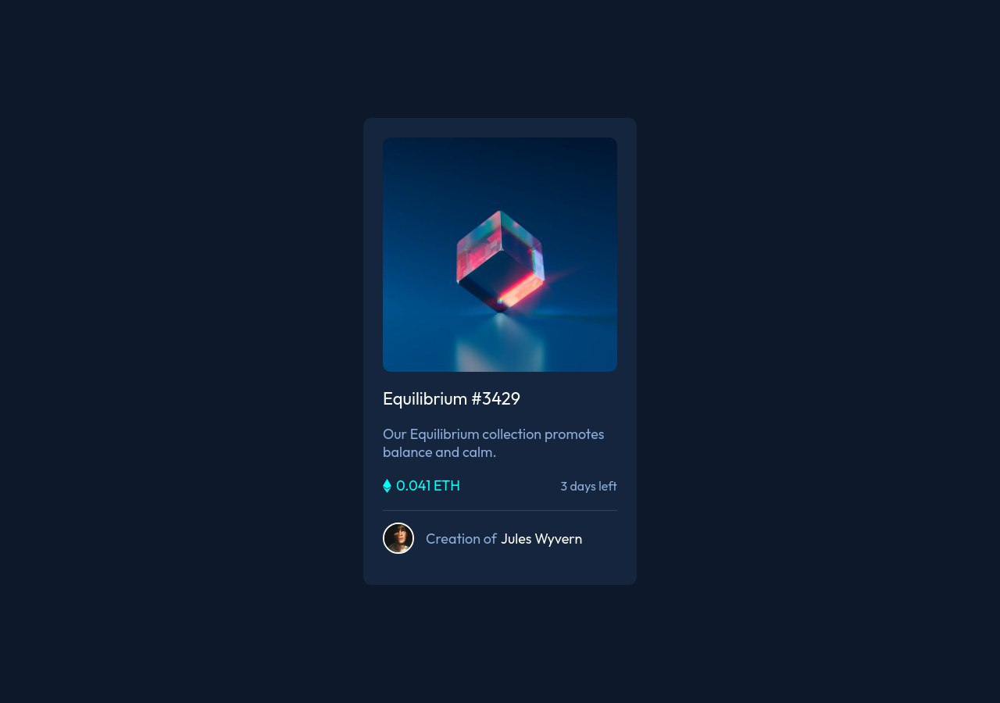

# Frontend Mentor - NFT preview card component solution

This is a solution to the [NFT preview card component challenge on Frontend Mentor](https://www.frontendmentor.io/challenges/nft-preview-card-component-SbdUL_w0U). Frontend Mentor challenges help you improve your coding skills by building realistic projects. 

## Overview

### Screenshot

### Links

- Solution URL: (https://github.com/maga-sv/nft-preview-card-component)
- Live Site URL: (https://nft-preview-card-component-ms.netlify.app/)

## Author

- Frontend Mentor - [@maga_sv](https://www.frontendmentor.io/profile/maga-sv)
- Twitter - [@magadvlpr](https://www.twitter.com/magadvlpr)
- Telegram - [@maga_me](https://telegram.me/maga_me)
- Instagram - [@maga.sv](https://instagram.com/maga.sv)